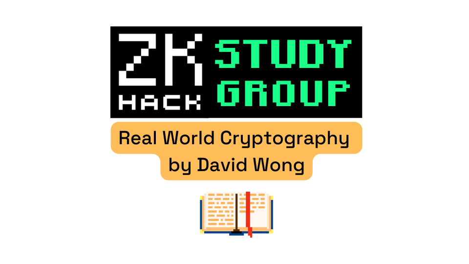

# RWC Study Group
Study Group repository for notes, code and related resources

## Getting started

1) Join the group on the [ZK HACK Discord server](https://discord.gg/xSWfCgDYZb)
 * Introduce yourself to the group and let us know what you hope to get from following along
 * Mark your meet-up time preference (see pinned comment)
2)
  * Create a repository for the lesson(s) and make a markdown file showing your answers for the exercises. (Click links below lesson plan for assignments, here's an example how I structured my answers [here](https://github.com/nickmura/rwc-exercises-lessons/blob/main/lesson2_mac-aes/exercises.md).
  * Make a src folder for the lesson

1) Prepare your development environment
1) Learn and build
1) Share your questions/answers/code/exercises/ideas with the group
1)

## Lesson Plan
0. [Overview](docs/lesson_00-Overview/index.md)
1. [Hash Functions](docs/lesson_01-Hash_Functions/index.md)
2. [Message authentication codes & Advanced encryption](docs/lesson_02-MAC-AES/index.md)
3. [Key exchanges & Asymmetric encryption and hybrid encryption](docs/lesson_03-DH-ASYMMETRIC/index.md)
